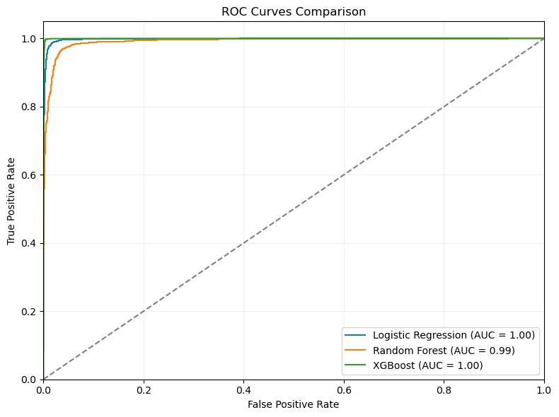

# 📰 Fake News Detection using NLP & Machine Learning

This project builds a machine learning pipeline to detect fake news articles based on their content. Using natural language processing (NLP) techniques, we classify news as either **Fake** or **Real**. The goal is to help mitigate misinformation by demonstrating the power of data science in content verification.

We trained multiple models and achieved **up to 99.65% accuracy** using XGBoost. We also emphasized interpretability with logistic regression and feature importance analysis.

---

## 📦 Project Structure

- `FakeNews_Detection.ipynb` → Full notebook (EDA → Preprocessing → Modeling → Evaluation)
- `data/` → Contains the original datasets (`True.csv`, `Fake.csv`)
- `visuals/` → Word clouds, ROC curves, feature importance charts (optional)
- `requirements.txt` → Python packages used
- `README.md` → Project overview, findings, and usage instructions

---

## 🧠 Key Features

- 🔍 Exploratory Data Analysis (EDA)
  - Word count distributions
  - Word clouds for Fake vs Real news
- ✂️ Text cleaning & preprocessing
- 🧾 Feature extraction with TF-IDF
- 🤖 ML models:
  - Logistic Regression
  - Random Forest
  - XGBoost (top performer)
- 📈 Evaluation metrics: Accuracy, ROC AUC, Confusion Matrix
- 📊 Interpretability:
  - Top predictive words (Logistic Regression)
  - Top features (XGBoost)

---

## 📊 Model Performance

| Model               | Accuracy | ROC AUC |
|---------------------|----------|---------|
| Logistic Regression | 98.39%   | 0.9838  |
| Random Forest       | 95.78%   | 0.9571  |
| XGBoost             | **99.65%** | **0.9966** |

> ✅ **XGBoost** achieved the best performance, while **Logistic Regression** offered excellent interpretability.




---

## 🌐 Dataset

- Source: [Kaggle Fake News Dataset](https://www.kaggle.com/clmentbisaillon/fake-and-real-news-dataset)
- [`Fake.csv`] — articles marked as fake  
- [`True.csv`] — articles from verified sources

---

## 🧰 Tech Stack

- Python
- Pandas, NumPy
- Scikit-learn
- XGBoost
- Matplotlib, Seaborn, WordCloud

---

## 📌 Insights

- Fake news often uses emotionally charged or politically biased words (e.g., "lying", "watch", "gop")
- Real news is more likely to mention institutional sources and structured reporting (e.g., "reuters", "statement", "reporters")
- TF-IDF with traditional models like XGBoost and Logistic Regression can still outperform deep learning on smaller datasets

---

## 🚀 How to Run

1. Clone this repo  
2. Install required libraries:
   ```bash
   pip install -r requirements.txt

---

## 📬 Author

**Victor Kioko Mutua**  
📧 kiokovictor78@gmail.com  
🌍 [GitHub Profile](https://github.com/Victorkiosh)  
🔗 [LinkedIn](www.linkedin.com/in/mutuavictor)
